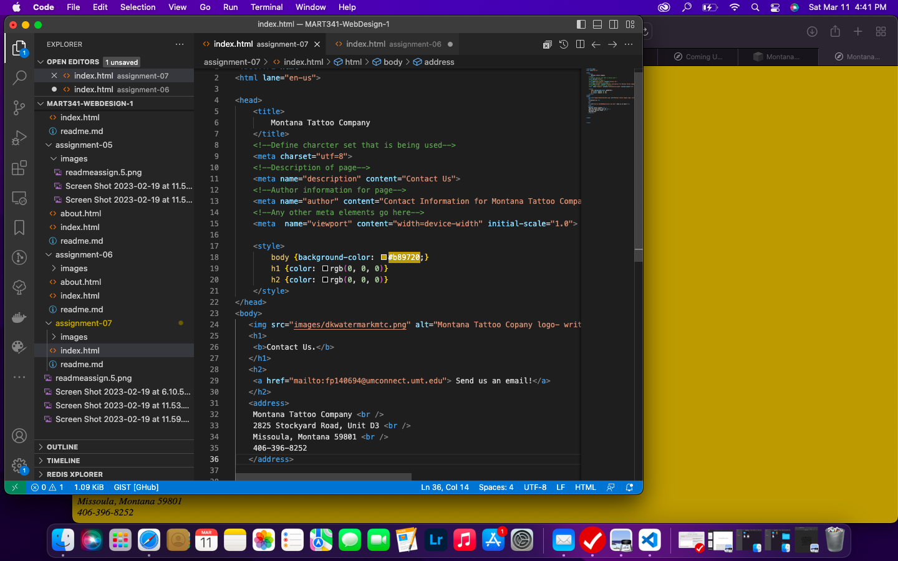

Nearly every website I encounter these days has a form on it. I most commonly see forms on websites for people to subscibe to email campaigns or newsletters of some sort. At work we use forms on our website to start any scheduling process to get all the client's information.

