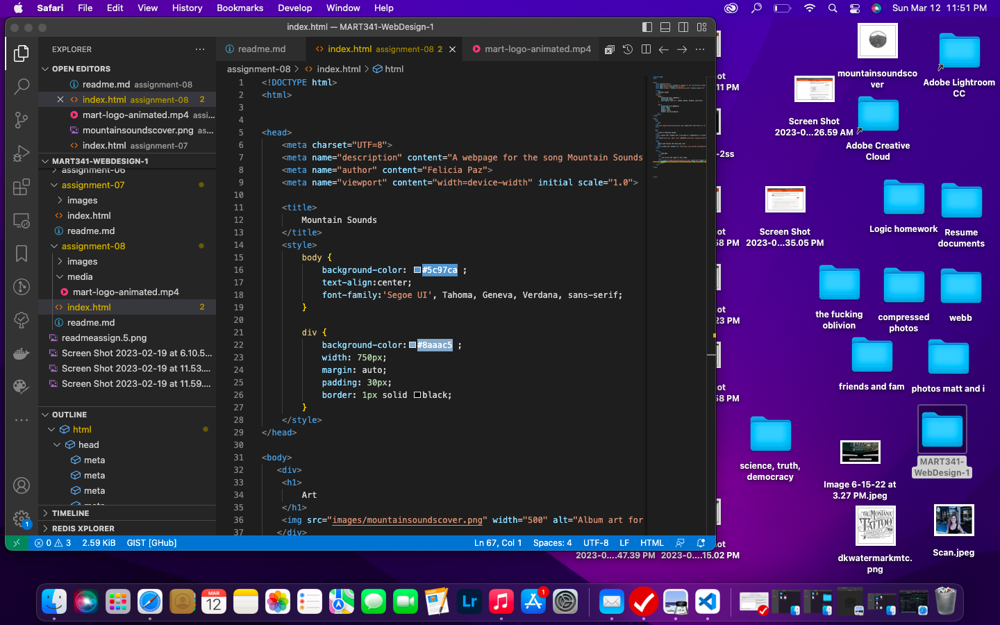

An affordance is the utilty or what is offered/useful from a particular object or situation. In web design affordances are important because the user learns through interacting. An dvantage of third party services are that they are generally easy to upload or embed into a website however copyright right issues can seem overwhelming to navigate. I struggled with the last part of the assignment because I didn't have a video to upload that matched or went along with the content and I couldn't get the class website's options to load properly for some reason. I was not able to work out my problems this assignment.

