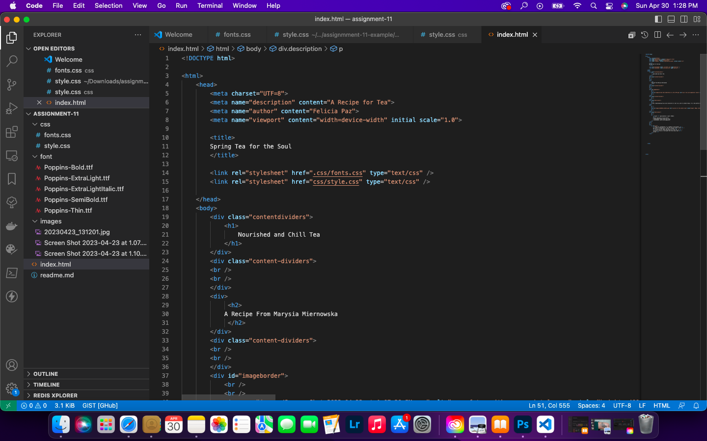

The importance of having fallback fonts or a font stack because different fonts aren't suported by certain browsers so you'd want either a speicifced font for the browser to fallback on or you would want to have a font stack so it can default to that stack of fonts. This is incredibly iportant in making sure your conetnt is viewable to as many differnt broswers as you can.
The difference between a system font, web font, and web-safe font is a web safe font and a system font are already assumed to be on most devices and nothing needs to be downloaded whereas a web font is downloaded and has many alternatives. This also makes it liekly to be supporting by less browsers which is why we have fallback fonts and fon stacks. 
